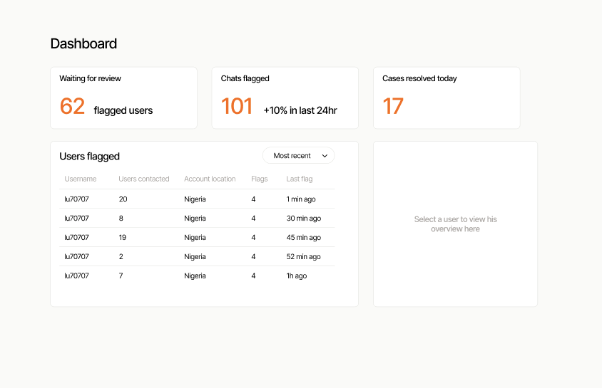
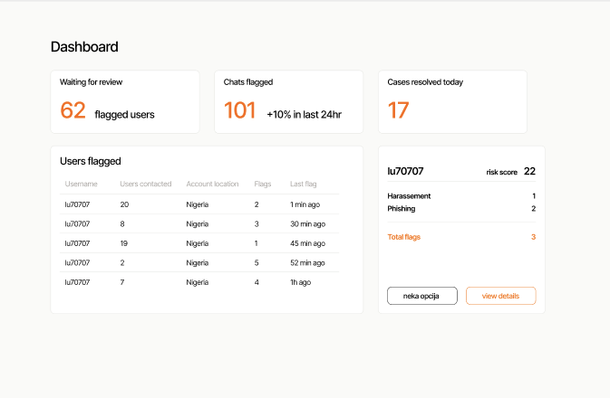
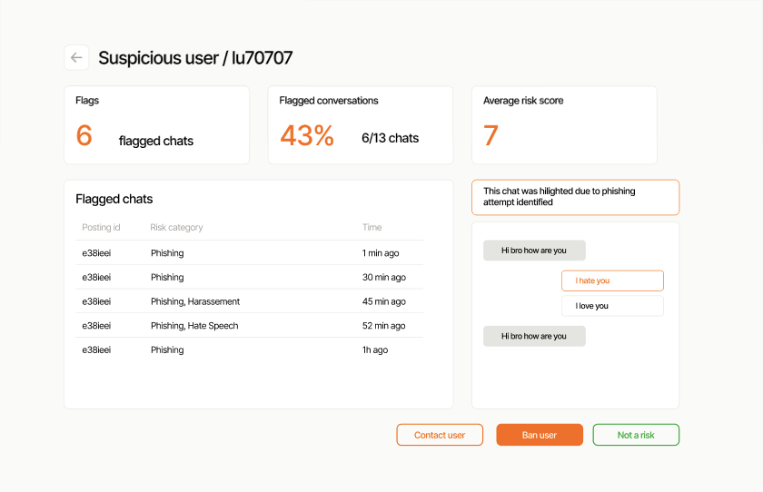

# PEERAI — AI-Driven Peer Moderation Platform 🛡️🤖

PEERAI is a hackathon-built platform designed to enhance community safety by enabling peer-based moderation using AI-assisted tools. It empowers users to **review**, **flag**, and **investigate** inappropriate interactions or user behavior in digital communities.

Built during a fast-paced sprint, this app combines a sleek interface with essential moderation workflows, all backed by modern frontend technology.

---

## 🚀 Features

- 🔍 **User Overview**: Browse and search platform users via a clean, minimal interface.
- 🧠 **AI Assistance** *(planned)*: Built with potential for future integration of AI tools to auto-flag harmful behavior.
- 👁️ **User Detail View**: Investigate user activity and history with one click.
- 🏷️ **Flagging System**: Mark users for admin review or escalation.
- 📱 **Responsive Design**: Mobile-friendly layout for moderators on the go.

---

## 📸 Screenshots

### Home Page


### Select User View


### View User Details


---

## 🛠️ Built With

- **Next.js** – Framework for fast, production-ready React apps.
- **Tailwind CSS** – Utility-first CSS framework for rapid UI development.
- **TypeScript** – Type-safe codebase.
- **Shadcn/UI** – Clean and accessible component system.

---

## 🧑‍💻 Usage

1. **Launch the App**: Clone the repo and run the dev server.
2. **View Users**: On the homepage, see a list of users in the system.
3. **Inspect Profiles**: Click any user to view more details and their flagged status.
4. **Moderate**: Flag users directly from their profile page.

```bash
npm install
npm run dev
